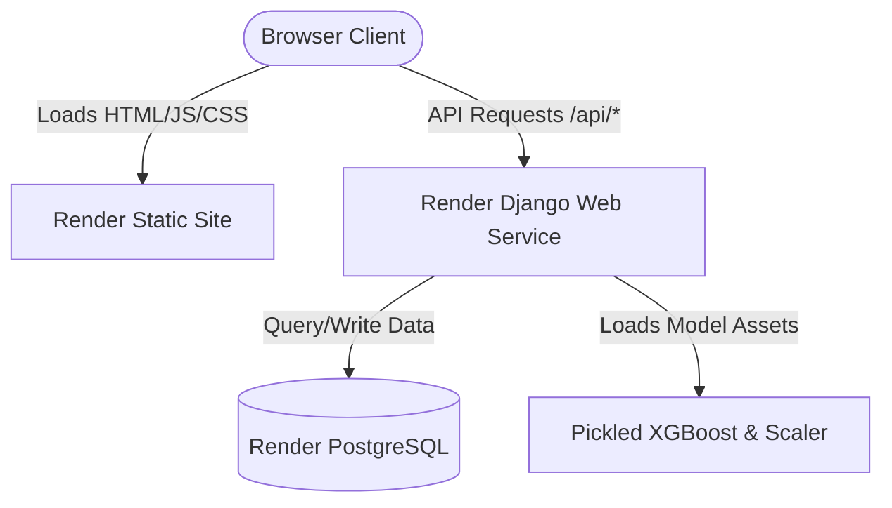

# Educational Early Warning System (EWS) - Render Deployment Guide

This guide describes how to deploy the Early Warning System (EWS) to **Render** using a production-ready PostgreSQL database, Django backend web service, and React frontend static site.

---

## Deployment Architecture Overview

For a reliable production-grade deployment, the system is split into three resources on Render:
1. **Render PostgreSQL**: Persistent database instance (replaces the local SQLite database).
2. **Render Web Service (Django Backend)**: Runs the Django REST framework, serves API endpoints, loads ML models, and communicates with the database.
3. **Render Static Site (React + Vite Frontend)**: Serves the compiled static frontend files via CDN for fast load times.



---

## Step 1: Create a PostgreSQL Database on Render

Since Render's free web services have ephemeral local storage, the default `db.sqlite3` file will be wiped every time the backend restarts or spins down. Using Render's PostgreSQL ensures data persistence.

1. Log in to the [Render Dashboard](https://dashboard.render.com).
2. Click **New +** in the top right and select **PostgreSQL**.
3. Fill in the database details:
   - **Name**: `ews-database`
   - **Region**: Select the region closest to you (e.g., `Oregon (US West)` or `Frankfurt (EU Central)`). Remember this region, as all other services should be deployed in the same region for lower latency.
   - **Database Name**: `ews_db`
   - **Username**: `ews_user`
   - **Instance Type**: Select the **Free** tier (expires after 90 days).
4. Click **Create Database**.
5. Once active, scroll down to the **Connection Info** section and copy the **Internal Database URL** (if you deploy the backend service on Render in the same region) or **External Database URL**.

---

## Step 2: Deploy the Django Backend (Web Service)

The Django backend serves the REST API and runs machine learning inference.

1. From the Render Dashboard, click **New +** and select **Web Service**.
2. Connect your Git repository.
3. Configure the Web Service settings:
   - **Name**: `ews-backend`
   - **Region**: **Must be the same region** as your PostgreSQL database.
   - **Branch**: `main` (or whichever branch contains your deployment-ready code).
   - **Runtime**: `Python`
   - **Root Directory**: Leave blank (we will run from the repository root to access root dependencies).
   - **Build Command**: 
     ```bash
     python -m pip install --upgrade pip && pip install -r requirements.txt && python ews_backend/manage.py migrate && python ews_backend/manage.py collectstatic --noinput
     ```
     *(This upgrades pip to avoid compiler/source-build errors on modern dependencies, installs package requirements, runs database migrations on Postgres, and collects Django static admin assets).*
   - **Start Command**: 
     ```bash
     gunicorn --chdir ews_backend ews_backend.wsgi:application
     ```
     *(This changes the working directory to `ews_backend` and runs Django using the Gunicorn production server).*
   - **Instance Type**: Select the **Free** tier.

4. Locate the **Environment Variables** section (which has fields for **Name** and **Value**) and add the following environment variables. Note that the *Description* column below is just for your reference to explain what the variable does:
   
   | Name (Key) | Value | Description |
   | :--- | :--- | :--- |
   | `DATABASE_URL` | *[Your Database Connection URL]* | Paste the database URL from Step 1. |
   | `DJANGO_SECRET_KEY` | *[Generate a long random secure string]* | Production secret key for Django encryption. |
   | `DJANGO_DEBUG` | `False` | Disables debug mode for security and speed. |
   | `PYTHON_VERSION` | `3.11.9` | Tells Render which Python runtime version to build with. |

5. Click **Create Web Service**. Render will start downloading packages and deploying your service.

---

## Step 3: Run Database Seeding

Once the backend service status turns to **Live**, you must seed the PostgreSQL database with the ground-truth student dataset.

1. Go to your backend service dashboard on Render.
2. In the left-hand navigation pane, click on **Shell**.
3. Run the following command to run the Python data ingestion script:
   ```bash
   python ews_backend/manage.py seed_from_csv
   ```
   *This command parses the Nigerian Student Dropout Dataset CSV, runs the machine learning risk predictions in a vectorized batch, and seeds 4,400+ student profiles and risk alerts into PostgreSQL.*
4. *(Optional)* To access the Django Admin Portal (`/admin/`), create an admin user by running:
   ```bash
   python ews_backend/manage.py createsuperuser
   ```
   Follow the prompts to enter a username, email, and password.

---

## Step 4: Deploy the React Frontend (Static Site)

The frontend is built using Vite and connects to your backend API via cross-origin requests.

1. Copy the URL of your deployed Django Backend (e.g., `https://ews-backend.onrender.com`).
2. From the Render Dashboard, click **New +** and select **Static Site**.
3. Connect your Git repository.
4. Configure the Static Site settings:
   - **Name**: `ews-frontend`
   - **Branch**: `main`
   - **Root Directory**: `ews_frontend` *(Points Render to look inside the subfolder)*.
   - **Build Command**: `npm install && npm run build`
   - **Publish Directory**: `dist`
5. Click **Advanced** and add the following **Environment Variable**:

   | Key | Value | Description |
   | :--- | :--- | :--- |
   | `VITE_API_BASE_URL` | `https://ews-backend.onrender.com` | The URL of your Django backend. **Do NOT add a trailing slash** at the end. |

6. Click **Create Static Site**.

---

## Step 5: Verification & Testing

Once the Static Site is live:
1. Open the frontend URL (e.g., `https://ews-frontend.onrender.com`).
2. You will be greeted by the login screen.
3. Test logging in using the default accounts:
   - **Administrator**: Username `admin`, Password `password123`
   - **Academic Adviser**: Username `adviser`, Password `password123`
4. Verify that:
   - The Departmental Overview dashboard displays the predictive risk charts (Recharts).
   - Clicking on a student correctly loads their detailed demographic details and risk timeline.
   - Resolving or updating an alert from the **Alert Management** page works correctly and persists across refreshes.
   - Ingesting a custom manual record from the **Admin Ingest Console** triggers the machine learning engine and generates a prediction successfully.
